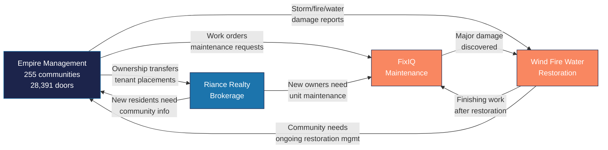

---
tags:
  - company
  - cross-sell
  - strategy
  - revenue
aliases:
  - Cross-Sell
  - Inter-Company Revenue
created: 2026-04-14
updated: 2026-04-14
---

# Cross-Sell Matrix

> [!info] The four [[Riance LLC Overview|Riance LLC]] companies form a closed-loop ecosystem. Every customer interaction in one company creates opportunities for the others. This matrix maps those flows.

---

## Cross-Sell Flow Diagram

---

## Opportunity Matrix

### EMG to Other Companies

| Trigger Event (EMG) | Target Company | Opportunity | Est. Annual Volume | Est. Revenue Impact |
|---------------------|---------------|-------------|-------------------|-------------------|
| Maintenance work order created | [[FixIQ]] | Dispatch FixIQ for eligible tasks | ~2,400/year | $200-400K |
| Storm/water damage reported | [[Wind Fire Water]] | Restoration dispatch | ~100/year | $300-500K |
| Ownership transfer detected | [[Riance Realty]] | Listing/buying agent referral | ~2,400/year | $500K-1M |
| Tenant placement request | [[Riance Realty]] | Leasing service | ~600/year | $150-300K |
| Unit turnover | [[FixIQ]] | Make-ready services | ~240/year | $50-100K |
| SB 4D inspection finding | [[Wind Fire Water]] | Structural remediation | ~50/year | $200-500K |

### Riance Realty to Other Companies

| Trigger Event (Realty) | Target Company | Opportunity |
|-----------------------|---------------|-------------|
| Sale closing in managed community | [[Empire Management Group\|EMG]] | New owner onboarding, welcome packet |
| Buyer needs pre-purchase inspection | [[FixIQ]] | Inspection/estimate service |
| Property needs renovation before listing | [[FixIQ]] | Renovation services |
| Buyer discovers damage during inspection | [[Wind Fire Water]] | Restoration estimate |

### Wind Fire Water to Other Companies

| Trigger Event (WFW) | Target Company | Opportunity |
|---------------------|---------------|-------------|
| Restoration complete, finishing needed | [[FixIQ]] | Touch-up, painting, minor repairs |
| Community needs ongoing damage mgmt | [[Empire Management Group\|EMG]] | Enhanced management contract |
| Insurance payout creates renovation budget | [[FixIQ]] | Renovation services |
| Damaged unit needs to be sold | [[Riance Realty]] | Listing services |

### FixIQ to Other Companies

| Trigger Event (FixIQ) | Target Company | Opportunity |
|-----------------------|---------------|-------------|
| Major damage discovered during repair | [[Wind Fire Water]] | Full restoration escalation |
| Owner mentions selling/renting unit | [[Riance Realty]] | Sales/leasing referral |
| Recurring issues signal systemic problem | [[Empire Management Group\|EMG]] | Capital improvement recommendation |

---

## Vera Platform Automation

The [[Automation Agents|cross-sell intelligence agent]] (#11) runs daily to detect these opportunities:

| Detection Method | Description |
|-----------------|-------------|
| **Work order analysis** | Flag eligible orders for FixIQ/WFW routing |
| **Ownership change detection** | Trigger Riance Realty referral |
| **Damage keyword matching** | Route reports to appropriate company |
| **Estoppel activity** | Signal closing activity for realty engagement |
| **Seasonal patterns** | Pre-position WFW for hurricane season |

---

## Revenue Potential (Estimated)

| Cross-Sell Path | Current Capture | Addressable | Gap |
|----------------|----------------|-------------|-----|
| EMG → FixIQ | ~30% | $400K/year | Automate routing, expand services |
| EMG → WFW | ~50% | $500K/year | Already strong due to proximity |
| EMG → Realty | ~10% | $1M/year | Largest untapped opportunity |
| Realty → FixIQ | ~5% | $100K/year | Needs referral workflow |
| WFW → FixIQ | ~40% | $80K/year | Good natural handoff |

> [!warning] The largest revenue gap is **EMG to Riance Realty** — ownership transfers happen constantly across 28,391 doors, but only ~10% are captured as referrals. Automating this detection in Vera could unlock $500K-1M in additional revenue.

---

*Related: [[Riance LLC Overview]] · [[Empire Management Group]] · [[Riance Realty]] · [[Wind Fire Water]] · [[FixIQ]] · [[Growth Opportunities]]*
