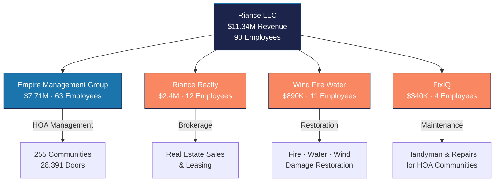

---
tags:
  - company
  - riance
  - holding-company
  - financials
aliases:
  - Riance
  - Riance LLC
  - Parent Company
created: 2026-04-14
updated: 2026-04-14
---

# Riance LLC

> [!info] Riance LLC is the holding company for Empire Management Group and three sister companies. Founded and led by **JR Riestra** (CEO). Headquartered in Central Florida.

---

## Corporate Structure

---

## Consolidated Metrics

| Metric | Value |
|--------|-------|
| **Total Revenue** | $11.34M |
| **Total Employees** | 90 |
| **Companies** | 4 |
| **Primary Market** | Florida |
| **CEO** | JR Riestra |

---

## Subsidiaries

| Company | Revenue | Employees | Focus | Vault Note |
|---------|---------|-----------|-------|------------|
| [[Empire Management Group]] | $7.71M (68%) | 63 | HOA/COA/CDD Management | Primary business |
| [[Riance Realty]] | $2.4M (21%) | 12 | Real estate brokerage | Sales & leasing |
| [[Wind Fire Water]] | $890K (8%) | 11 | Restoration services | Fire/water/wind damage |
| [[FixIQ]] | $340K (3%) | 4 | Maintenance/handyman | Repairs for communities |

---

## Revenue Breakdown

| Company | Annual Revenue | % of Total | Monthly Run Rate |
|---------|---------------|------------|-----------------|
| Empire Management Group | $7,710,000 | 68.0% | $642,500 |
| Riance Realty | $2,400,000 | 21.2% | $200,000 |
| Wind Fire Water | $890,000 | 7.8% | $74,167 |
| FixIQ | $340,000 | 3.0% | $28,333 |
| **Total** | **$11,340,000** | **100%** | **$945,000** |

---

## Strategic Advantage: The Ecosystem

> [!tip] The four companies form a **closed-loop ecosystem** where each company generates leads for the others. See [[Cross-Sell Matrix]] for the full opportunity map.

1. **EMG** manages 255 communities with 28,391 doors — every door is a potential customer for all four companies
2. **Riance Realty** handles sales/leasing within managed communities — warm leads from EMG
3. **Wind Fire Water** responds to restoration needs in managed communities — EMG is the first call
4. **FixIQ** handles maintenance requests generated by EMG's work order system — direct pipeline

---

## Technology Platform

The [[Architecture Overview|Vera platform]] serves as the unified operating system across all four companies:
- **EMG**: Full community management, accounting, compliance, communications
- **Riance Realty**: CRM integration via HubSpot, lead tracking
- **WFW**: Work order pipeline from EMG communities
- **FixIQ**: Vendor portal, maintenance request routing

---

## Key Risks

> [!warning] Revenue Concentration
> Empire Management Group represents **68%** of total Riance revenue. Diversification into Riance Realty growth and FixIQ expansion is a strategic priority. See [[Growth Opportunities]] for mitigation strategies.

---

*Related: [[Empire Management Group]] · [[Cross-Sell Matrix]] · [[Growth Opportunities]] · [[Competitive Landscape]]*
