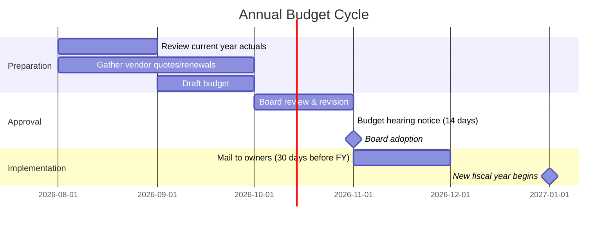

---
tags:
  - financial
  - budget
  - template
  - accounting
aliases:
  - Budget
  - Community Budget
  - Budget Categories
created: 2026-04-14
updated: 2026-04-14
---

# Budget Template

> [!info] This is the standard community budget template used across [[Empire Management Group]]'s 255 communities. Categories align with Vera's chart of accounts and GL structure defined in [[Database Schema|migration 003]].

---

## Standard Budget Categories

### Revenue

| Account | Category | Description | Typical % of Budget |
|---------|----------|-------------|-------------------|
| 4000 | **Assessment Income** | Regular monthly/quarterly/annual assessments | 85-95% |
| 4100 | **Special Assessment Income** | Board-approved special assessments | Variable |
| 4200 | **Late Fee Income** | Late fees on overdue assessments | 1-3% |
| 4300 | **Interest Income** | Bank account interest, reserve fund earnings | 0.5-2% |
| 4400 | **Application/Transfer Fees** | Resale, estoppel, ARC application fees | 1-3% |
| 4500 | **Rental/Lease Income** | Clubhouse rentals, common area leasing | 0-5% |
| 4600 | **Fines & Penalties** | Violation fines | 0.5-1% |
| 4900 | **Other Income** | Miscellaneous revenue | 0-2% |

### Operating Expenses

| Account | Category | Description | Typical % of Budget |
|---------|----------|-------------|-------------------|
| **5000** | **Management Fees** | [[Empire Management Group\|EMG]] management contract | 10-18% |
| **5100** | **Insurance** | Master policy, D&O, fidelity, umbrella | 12-20% |
| **5200** | **Utilities** | Water, electric, gas, sewer, trash | 8-15% |
| **5300** | **Landscaping & Grounds** | Lawn care, tree trimming, irrigation | 8-15% |
| **5400** | **Pool & Amenities** | Pool service, fitness equipment, tennis | 3-8% |
| **5500** | **Maintenance & Repairs** | General building maintenance | 5-12% |
| **5600** | **Janitorial / Cleaning** | Common area cleaning | 2-5% |
| **5700** | **Security / Access Control** | Guard service, gate maintenance, cameras | 3-10% |
| **5800** | **Legal & Professional** | Attorney, CPA, reserve study | 2-5% |
| **5900** | **Administrative** | Office supplies, postage, printing, bank fees | 1-3% |

### Reserve Contributions

| Account | Category | Description |
|---------|----------|-------------|
| 6000 | **Roof Reserve** | Roof replacement/repair fund |
| 6100 | **Painting Reserve** | Exterior painting cycle |
| 6200 | **Pavement Reserve** | Roads, parking lots, sidewalks |
| 6300 | **Pool/Amenity Reserve** | Pool resurfacing, equipment replacement |
| 6400 | **Structural Reserve** | Building structural repairs (SB 4D) |
| 6500 | **General Reserve** | Catch-all for unexpected capital needs |

> [!warning] Florida law requires adequate reserves. Boards can vote to waive or reduce reserves, but this must be a membership vote (not just board). Communities with waived reserves face higher risk from [[Florida HOA Compliance|SB 4D]] inspection findings.

---

## Budget Preparation Timeline



---

## Budget vs. Actual Monitoring

Vera's [[Automation Agents|Financial Health agent (#9)]] monitors budget variance daily:

| Variance Level | Action |
|---------------|--------|
| **< 5%** | No action (normal fluctuation) |
| **5-10%** | Note for monthly report to board |
| **10-20%** | Alert CAM; require explanation |
| **> 20%** | Alert CAM + Director; board notification recommended |

### Common Variance Causes

| Category | Common Over-Budget Cause | Mitigation |
|----------|------------------------|------------|
| Insurance | Premium increases (FL market) | Multi-year quotes, higher deductibles |
| Utilities | Rate increases, water leaks | Sub-metering, conservation programs |
| Legal | Unexpected litigation | Reserve for legal; mediation first |
| Maintenance | Emergency repairs | Preventive maintenance via [[FixIQ]] |
| Landscaping | Hurricane cleanup | Insurance claims coordination via [[Wind Fire Water\|WFW]] |

---

## Assessment Calculation

```
Total Budget - Non-Assessment Revenue = Net Assessment Need
Net Assessment Need / Total Assessable Units = Per-Unit Assessment
Per-Unit Assessment / 12 = Monthly Assessment

Example:
$500,000 budget - $25,000 other income = $475,000
$475,000 / 200 units = $2,375/unit/year
$2,375 / 12 = $197.92/month
```

> [!tip] Some communities have variable assessments based on unit size (square footage) or lot type. Vera supports both flat and variable assessment schedules via the `assessment_schedules` configuration per association.

---

## Vera Budget Features

| Feature | Description |
|---------|-------------|
| **Budget creation** | Create from scratch or copy prior year |
| **Auto-adjustment** | Apply percentage increase to all or selected categories |
| **Variance tracking** | Real-time budget vs. actual comparison |
| **Board reports** | PDF/Excel export for board meetings |
| **Assessment calculator** | Auto-compute per-unit assessment from budget |
| **Reserve projection** | Forecast reserve balance with contribution schedule |

---

*Related: [[Portfolio Financial Health]] · [[Pricing Benchmarks]] · [[Florida HOA Compliance]] · [[Empire Management Group]]*
