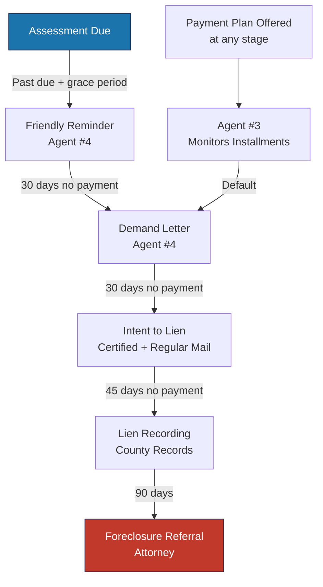

---
tags:
  - financial
  - health
  - ar
  - delinquency
  - collections
aliases:
  - Financial Health
  - AR Overview
  - Portfolio Health
created: 2026-04-14
updated: 2026-04-14
---

# Portfolio Financial Health

> [!info] This document describes the key financial health metrics tracked across [[Empire Management Group]]'s portfolio of 255 communities. The [[Automation Agents|Financial Health agent (#9)]] analyzes these metrics daily and posts alerts to Discord.

---

## Key Metrics Dashboard

| Metric | Target | Warning | Critical |
|--------|--------|---------|----------|
| **Portfolio Collections Rate** | > 95% | 90-95% | < 90% |
| **90+ Day Delinquency Rate** | < 3% | 3-5% | > 5% |
| **Average Days to Collect** | < 35 days | 35-45 days | > 45 days |
| **Communities at Risk** | 0 | 1-5 | > 5 |
| **Active Payment Plans** | Tracking | N/A | High default rate |

---

## Accounts Receivable Aging

### Standard Aging Buckets

| Bucket | Days | Action Required |
|--------|------|----------------|
| **Current** | 0-30 days | No action — within grace period |
| **30-60 days** | 31-60 days | Friendly reminder (automated) |
| **60-90 days** | 61-90 days | Demand letter (automated escalation) |
| **90-120 days** | 91-120 days | Intent to lien notice per [[Florida HOA Compliance|FS 720.3085]] |
| **120+ days** | 121+ days | Lien recording / attorney referral |

### AR Monitoring Workflow

---

## Community Health Scoring

Each community receives a financial health score (0-100) based on:

| Factor | Weight | Scoring |
|--------|--------|---------|
| **Collections rate** | 30% | 95%+ = 30pts, 90-95% = 20pts, <90% = 10pts |
| **Delinquency rate (90+ days)** | 25% | <2% = 25pts, 2-5% = 15pts, >5% = 5pts |
| **Budget variance** | 20% | <5% = 20pts, 5-10% = 12pts, >10% = 5pts |
| **Reserve funding level** | 15% | >80% = 15pts, 50-80% = 10pts, <50% = 5pts |
| **Payment plan performance** | 10% | >90% on track = 10pts, <90% = 5pts |

### Health Score Ranges

| Score | Rating | Action |
|-------|--------|--------|
| 80-100 | Excellent | Routine monitoring |
| 60-79 | Good | Monitor monthly; address variances |
| 40-59 | At Risk | Bi-weekly review; board notification |
| 0-39 | Critical | Weekly review; board meeting; remediation plan |

---

## Budget Variance Analysis

### Monitored Variance Categories

| Category | Acceptable Variance | Alert Threshold |
|----------|-------------------|-----------------|
| **Revenue (assessments)** | +/- 5% | > 5% under budget |
| **Operating expenses** | +/- 10% | > 10% over budget |
| **Insurance** | +/- 5% | Any increase > 5% |
| **Utilities** | +/- 15% | > 15% over budget (seasonal) |
| **Maintenance/repairs** | +/- 20% | > 20% over budget |
| **Legal fees** | +/- 25% | > 25% over budget |
| **Reserve contributions** | 0% | Any shortfall |

> [!warning] Reserve contribution shortfalls are the most critical variance. Florida statute requires adequate reserves, and boards that underfund reserves face personal liability under SB 4D for structural issues.

---

## Delinquency Analysis

### Common Delinquency Patterns

| Pattern | Description | Action |
|---------|-------------|--------|
| **Seasonal spike** | Delinquency rises in Q1 (post-holiday) | Expected; will self-correct by Q2 |
| **Single unit outlier** | One owner with large balance skews community stats | Address individually; don't change community policy |
| **Systemic rise** | Multiple units becoming delinquent simultaneously | Economic indicator; review payment plan offerings |
| **New community** | First 6 months after onboarding show higher delinquency | Normal during transition; owners adjusting to new payment system |
| **Assessment increase** | Spike after annual assessment increase | Pre-communicate; offer payment plans |

### Red Flags

> [!warning] Investigate immediately if any of these appear:

- Community delinquency rate jumps > 5% in a single month
- 3+ owners with $10K+ balances in one community
- Payment plan default rate exceeds 30%
- Assessment posting errors (agent #1 failure)
- Late fee application errors (agent #2 failure)

---

## Reporting Cadence

| Report | Audience | Frequency | Source |
|--------|----------|-----------|--------|
| Portfolio AR Aging | Executive/Director | Weekly | Financial Health Agent |
| Community Health Scores | CAMs | Daily (via dashboard) | Vera analytics |
| Delinquency Alerts | CAMs + Accounting | Real-time | Collection Escalation Agent |
| Budget Variance Report | Board + CAM | Monthly | Vera financials module |
| Collections Pipeline | Accounting Lead | Weekly | Vera collections module |
| Reserve Funding Status | Board | Quarterly | Reserve study + actuals |

---

*Related: [[Automation Agents]] · [[Pricing Benchmarks]] · [[Budget Template]] · [[Empire Management Group]] · [[Daily Runbook]]*
