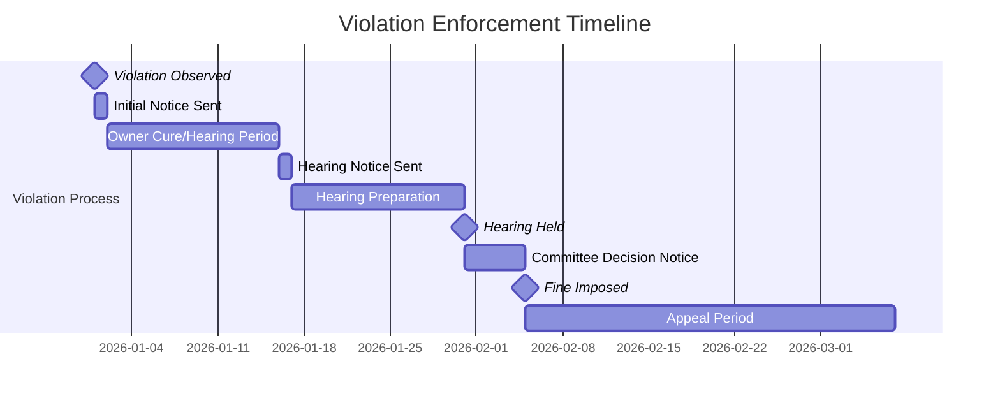
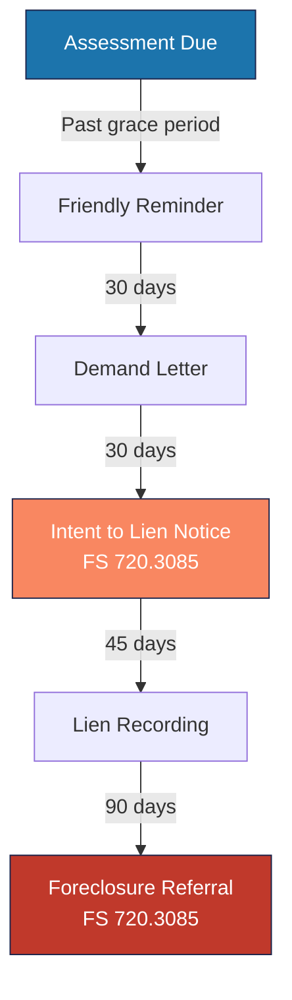

---
tags:
  - operations
  - compliance
  - florida
  - legal
  - statutes
aliases:
  - FL Compliance
  - Florida Statutes
  - HOA Law
  - Statutory Compliance
created: 2026-04-14
updated: 2026-04-14
---

# Florida HOA Compliance

> [!info] Empire Management Group operates exclusively in Florida. Vera must enforce compliance with Florida Statutes Chapters 718 (Condominiums), 719 (Cooperatives), and 720 (HOAs), plus SB 4D structural inspection requirements. All timelines in this document are **statutory minimums** — they are hard-coded in Vera and cannot be overridden.

---

## Governing Statutes

| Chapter | Applies To | Key Topic |
|---------|-----------|-----------|
| **FS 718** | Condominiums (COA) | Condo governance, fining, collections, elections |
| **FS 719** | Cooperatives | Co-op governance (similar to 718) |
| **FS 720** | Homeowner Associations (HOA) | HOA governance, fining, collections, elections |
| **FS 61B-23** | All | Administrative rules for fining procedures |
| **FS 45.031** | All | Notice requirements for acceleration |
| **SB 4D** (2022) | Condos 3+ stories | Milestone structural inspections |

---

## Violations Module

### Enforcement Timeline (FS 720.305 / FS 718.303)

### Key Deadlines

| Step | Timeline | Statute |
|------|----------|---------|
| **Owner response to initial notice** | 14 days | FS 720.305(2)(b) |
| **Hearing notice period** | Minimum 14 days | FS 720.305(2)(c) |
| **Committee decision notice** | 5 business days | Best practice |
| **Appeal deadline** | 30 days | FS 720.311 |
| **Maximum fine per violation** | $1,000 | FS 720.305(2)(b) |
| **Daily fine maximum** | $1,000 total | FS 720.305(2)(b) |

### Initial Notice Requirements (FS 720.305(2)(b))

> [!warning] Every initial violation notice MUST contain all of these elements. Missing any one can invalidate the enforcement action.

- Date of alleged violation
- Description of alleged violation
- Reference to **specific** governing document provision violated
- Statement: owner has 14 days to request hearing OR cure violation
- Notice of right to legal counsel at hearing
- Contact information for requesting hearing

### Hearing Notice Requirements (FS 720.305(2)(c))

- At least 14 days advance notice
- Time, date, and location of hearing
- Right to attend with counsel
- Right to present evidence and witnesses
- Right to cross-examine witnesses

### Fine Notice Requirements

- Specific violation found
- Fine amount (must comply with community limits or $1,000 max)
- Payment due date
- Appeal rights to dispute resolution (FS 720.311)
- Reference to specific governing document provision

---

## Collections Module

### Collection Escalation Timeline (FS 720.3085)

### Intent to Lien Notice (FS 720.3085(2)(a))

> [!warning] The Intent to Lien notice has strict content requirements. Failure to include all elements can void the lien.

**Required content:**
- Total amount of lien (principal, interest, costs, attorney fees)
- Description of each assessment and due date
- Name of current record owner
- Legal description of property
- Statement: "INTENT TO RECORD LIEN"
- 45-day deadline to pay before lien recording
- Right to contest/request hearing
- Payment plan availability per FS 720.3088

**Delivery:** Certified mail AND regular mail to both property address and mailing address of record.

### Payment Plans (FS 720.3088)

- Associations **must offer** payment plans for delinquent assessments
- Plan must be reasonable and allow cure without immediate lien
- Vera's [[Automation Agents|payment plan agent]] processes installments daily

---

## Elections & Meetings

### Board Meeting Requirements

| Requirement | Statute | Details |
|------------|---------|---------|
| **Notice period** | 14 days (posted) + 14 days (mailed for budget) | FS 720.303(2) |
| **Quorum** | Per bylaws (typically 30% of eligible voters) | Community-specific |
| **Proxy voting** | Must comply with FS 720.306 | Limited proxies allowed |
| **Board certification** | Required within 90 days of election | FS 720.3033 |

### Annual Meeting Requirements

| Requirement | Details |
|-------------|---------|
| **Notice** | Mailed at least 14 days prior |
| **Budget adoption** | Board must adopt budget at least 30 days before fiscal year |
| **Election of directors** | At annual meeting; term limits per bylaws |
| **Financial report** | Must be presented at annual meeting |

---

## SB 4D — Milestone Inspections

> [!info] Senate Bill 4D (2022) requires structural inspections for condominium buildings 3+ stories. This is a critical compliance area for managed COA communities.

### Requirements

| Rule | Details |
|------|---------|
| **Applies to** | Condominium buildings 3+ stories |
| **Initial inspection** | By December 31, 2024 (for buildings 30+ years old within 3 miles of coast) |
| **Subsequent** | Every 10 years after initial |
| **Inspector** | Licensed engineer or architect |
| **Reporting** | Must be submitted to local building official |

### Vera Integration

- `compliance/` module tracks inspection due dates
- Automated alerts 12 months, 6 months, 90 days before due date
- Document storage for inspection reports
- Board notification workflow for findings requiring remediation

> [!warning] Failure to comply with SB 4D can result in the condominium being declared unsafe for occupancy. This is the highest-priority compliance item for any managed COA.

---

## Record Retention Requirements

| Record Type | Retention Period | Statute |
|------------|-----------------|---------|
| Financial records | 7 years minimum | FS 720.303(4) |
| Meeting minutes | Permanently | Best practice |
| Governing documents | Permanently | Required |
| Contracts | Life of contract + 5 years | Best practice |
| Violation records | 7 years | Best practice |
| Insurance policies | Life of policy + 5 years | Best practice |
| Tax returns | 7 years | IRS requirement |
| Owner ledger history | 7 years minimum | FS 720.303(4) |

---

## Vera Compliance Features

| Feature | Status | Description |
|---------|--------|-------------|
| **Statutory timeline engine** | Built | Hard-coded FL deadlines for violations, collections |
| **Auto-escalation** | Built | [[Automation Agents|Agent #5]] auto-advances violations on deadline |
| **Notice generation** | Built | AI-powered notice drafting with required statutory language |
| **Collection workflow** | Built | [[Automation Agents|Agent #4]] manages escalation pipeline |
| **Board certification tracking** | Built | 90-day deadline tracking post-election |
| **Compliance calendar** | Built | `.ics` export for all compliance deadlines |
| **SB 4D tracking** | Built | Milestone inspection due date monitoring |
| **Audit trail** | Built | Immutable log of all compliance-related actions |

---

*Related: [[Empire Management Group]] · [[Automation Agents]] · [[Onboarding New Community]] · [[Multi-State Expansion]]*
