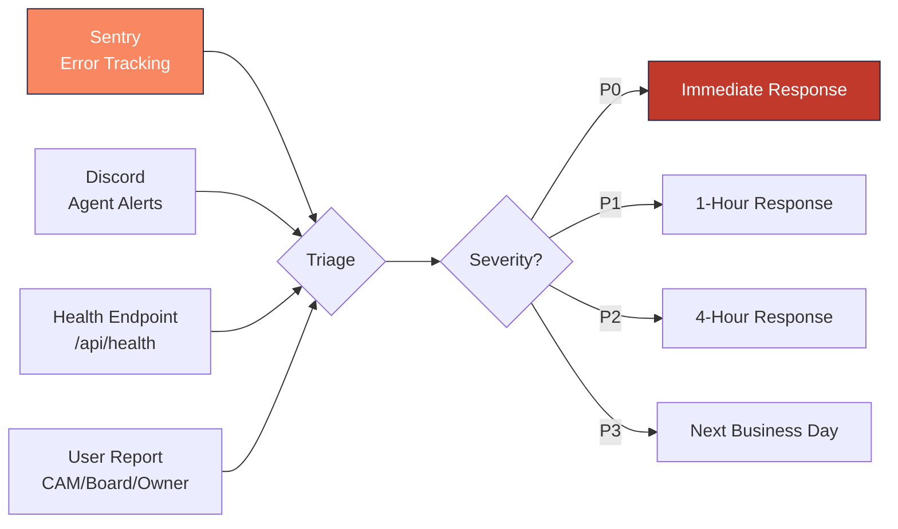

---
tags:
  - operations
  - incident
  - response
  - monitoring
  - sentry
aliases:
  - Incident Response
  - On-Call
  - Outage Playbook
created: 2026-04-14
updated: 2026-04-14
---

# Incident Response

> [!info] When something breaks in Vera, this document guides the response. Incidents are detected via Sentry (errors), Discord (agent failures), health endpoint monitoring, and user reports.

---

## Severity Levels

| Level | Description | Response Time | Examples |
|-------|-------------|---------------|---------|
| **P0 — Critical** | Data loss, financial corruption, full outage | Immediate (< 15 min) | Payment processing down, tenant data leak, assessment posting error |
| **P1 — High** | Major feature broken, partial outage | < 1 hour | Agent failures, auth issues, portal down |
| **P2 — Medium** | Feature degraded, workaround exists | < 4 hours | Slow queries, UI rendering issues, email delivery delays |
| **P3 — Low** | Minor issue, cosmetic | Next business day | Styling bugs, non-critical warnings |

---

## Detection Sources

---

## P0 Response Playbook

### Step 1: Assess (0-5 minutes)
- [ ] Identify the scope: how many users/communities affected?
- [ ] Is data being corrupted or lost? (If yes, stop the bleeding first)
- [ ] Check Sentry for error details, stack trace, affected endpoint
- [ ] Check Vercel dashboard for deployment status

### Step 2: Contain (5-15 minutes)
- [ ] If an automation agent is causing damage: disable the cron job in Vercel
- [ ] If a specific API route is failing: check recent deployments for regressions
- [ ] If database issue: check Supabase dashboard for connection pool, slow queries
- [ ] If payment processing: check Stripe dashboard for system status

### Step 3: Communicate (15 minutes)
- [ ] Post to Discord: `@here P0 Incident — [Brief description] — Investigating`
- [ ] Notify CEO (JR Riestra) if financial data or customer-facing
- [ ] Notify accounting lead if financial operations affected

### Step 4: Resolve
- [ ] Fix the root cause (code fix, config change, data correction)
- [ ] Deploy fix (Vercel auto-deploys on push to main)
- [ ] Verify fix in production
- [ ] Run affected automation agents manually if they missed their window

### Step 5: Post-Mortem
- [ ] Document: What happened, when, who was affected, root cause, fix
- [ ] Create preventive measure (test, alert, guard)
- [ ] Post summary to Discord
- [ ] Log in [[Decision Log Template|decision log]] if architectural change needed

---

## Common Incident Scenarios

### Automation Agent Failure

> [!warning] If Discord shows a failure message from an agent, the most common causes are: Supabase connection timeout, bad data in a specific community, or a recent code deployment regression.

**Steps:**
1. Check Discord message for error details
2. Check Sentry for the full stack trace
3. Identify the failing community/record (usually in error metadata)
4. Fix data issue or code bug
5. Re-run the agent manually: `curl -X POST https://vera.vercel.app/api/automation/{agent} -H "Authorization: Bearer $AUTOMATION_SECRET"`

### Payment Processing Failure

**Steps:**
1. Check Stripe dashboard status page
2. Check `/api/stripe/*` routes in Sentry
3. Verify webhook endpoint is responding
4. If Stripe is down: no action needed, payments will retry
5. If Vera-side failure: check recent deployment, roll back if needed

### Authentication Issues

**Steps:**
1. Check Azure AD status (for internal users)
2. Check Supabase Auth dashboard (for external users)
3. Verify MSAL configuration hasn't changed
4. Check for expired certificates or secrets
5. Test login flow manually

### Database Performance

**Steps:**
1. Check Supabase dashboard for connection pool utilization
2. Look for slow queries (> 1s) in Supabase logs
3. Check for missing indexes on new tables
4. Verify RLS policies aren't causing full table scans
5. Consider adding index or optimizing query

### Deployment Regression

**Steps:**
1. Identify the breaking commit via Vercel deployment logs
2. Compare Sentry error timeline with deployment timestamp
3. Roll back via Vercel: redeploy previous successful deployment
4. Fix the issue in a new branch
5. Deploy fix after verification

---

## Key Health Checks

| Check | Method | Expected |
|-------|--------|----------|
| App health | `GET /api/health` | 200 OK |
| Supabase connection | Supabase dashboard | Active connections < pool limit |
| Vercel status | vercel.com/status | Operational |
| Stripe status | status.stripe.com | Operational |
| Sentry | sentry.io dashboard | No P0 errors |
| Discord webhook | Check for recent messages | Messages within last 24h |

---

## Rollback Procedures

### Vercel Deployment Rollback
1. Go to Vercel dashboard > Deployments
2. Find the last known good deployment
3. Click "Redeploy" (creates a new deployment from that commit)
4. Verify the rollback resolves the issue

### Database Rollback

> [!warning] Database rollbacks are extremely risky in production. Always prefer a forward-fix (new migration) over rolling back a migration. Coordinate with the engineering team.

---

## Escalation Matrix

| Severity | First Responder | Escalation (15 min) | Executive (30 min) |
|----------|----------------|---------------------|-------------------|
| P0 | On-call engineer | Engineering lead | CEO |
| P1 | On-call engineer | Engineering lead | — |
| P2 | Any engineer | — | — |
| P3 | Next sprint | — | — |

---

*Related: [[Daily Runbook]] · [[Security]] · [[Automation Agents]] · [[Architecture Overview]]*
