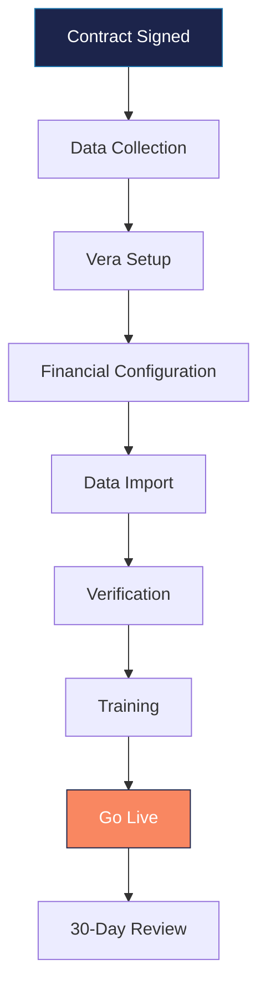

---
tags:
  - operations
  - onboarding
  - community
  - process
aliases:
  - New Community
  - Community Onboarding
  - Association Setup
created: 2026-04-14
updated: 2026-04-14
---

# Onboarding New Community

> [!info] This documents the process for adding a new HOA/COA/CDD community to the Vera platform. A thorough onboarding ensures clean data, proper configuration, and a smooth transition for the board and homeowners.

---

## Onboarding Flow

---

## Phase 1: Data Collection (Week 1)

### From the Board / Previous Manager

- [ ] Management contract (signed via [[Integrations|PandaDoc]])
- [ ] Declaration of Covenants, Conditions & Restrictions (CC&Rs)
- [ ] Bylaws
- [ ] Articles of Incorporation
- [ ] Rules and Regulations
- [ ] Current year budget (approved)
- [ ] Reserve study (most recent)
- [ ] Insurance policies (master, D&O, fidelity)
- [ ] Bank account information
- [ ] Current owner roster with contact info
- [ ] Current AR aging report
- [ ] Open violations list
- [ ] Open work orders
- [ ] Vendor contracts
- [ ] Board member list with terms and certifications
- [ ] Meeting minutes (last 12 months)

### From Previous Management Software

- [ ] Owner ledger history (if migrating from Vantaca or other system)
- [ ] Assessment schedules and amounts
- [ ] Chart of accounts
- [ ] Payment history
- [ ] Violation history

---

## Phase 2: Vera Configuration (Week 2)

### Association Record

- [ ] Create association in Vera (`/api/associations`)
  - Name, type (HOA/COA/CDD), address
  - `tenant_id` must match the Empire Management tenant
  - Set `fiscal_year_start_month`
  - Configure `settings` JSON (billing day, grace period, late fee rules)

### Property Setup

- [ ] Import all units/lots (`/api/associations/[id]/lots/import`)
  - Unit number, address, property type
  - Verify count matches declaration

### Owner Import

- [ ] Create contacts for all owners
- [ ] Create occupancy records (owner/tenant, primary/secondary)
- [ ] Link to properties

### Financial Setup

- [ ] Create funds (Operating, Reserve, Special if applicable)
- [ ] Import or create Chart of Accounts
- [ ] Configure assessment schedules
  - Assessment type, amount, frequency, billing day
  - Late fee rules (flat, percentage, daily, grace period)
- [ ] Set collection escalation rules per association policy
- [ ] Import opening balances

### Staff Assignment

- [ ] Assign CAM to community (`association_assignments`)
- [ ] Assign backup CAM
- [ ] Set notification preferences

### Compliance Configuration

- [ ] Set community type for correct statute application (FS 718/719/720)
- [ ] Configure violation categories from CC&Rs
- [ ] Set hearing committee composition
- [ ] Verify fine limits match governing documents
- [ ] Configure election rules (annual meeting month, quorum requirements)

---

## Phase 3: Data Verification (Week 3)

### Financial Verification

- [ ] Verify opening AR balance matches previous manager's final report
- [ ] Verify chart of accounts totals balance
- [ ] Run trial balance — must balance to zero
- [ ] Verify assessment amounts match approved budget
- [ ] Test late fee calculation on sample accounts

### Owner Data Verification

- [ ] Spot-check 10% of owner records against declaration/county records
- [ ] Verify email addresses (send test communication)
- [ ] Verify mailing addresses for physical notice delivery

### Document Verification

- [ ] All governing documents uploaded to Supabase Storage
- [ ] Documents linked to correct association
- [ ] Insurance policies with correct expiration dates

---

## Phase 4: Training (Week 3-4)

### Board Training

- [ ] Board portal walkthrough (30 minutes)
  - Dashboard, financials, meeting calendar, document library
  - Approval workflows (invoices, violations)
  - How to view meeting packets

### Homeowner Portal Setup

- [ ] Generate welcome letters with portal registration instructions
- [ ] Set up online payment (Stripe) for the community
- [ ] Test homeowner portal flow end-to-end

### CAM Onboarding

- [ ] CAM walkthrough of community in Vera (1 hour)
  - Owner ledger, violations, work orders, communications
  - Assessment posting and late fee review
  - Reporting and analytics

---

## Phase 5: Go Live

### Go-Live Checklist

- [ ] All data imported and verified
- [ ] Financial balances reconciled
- [ ] Board members have portal access
- [ ] Homeowner welcome letters sent
- [ ] Online payments enabled
- [ ] Automation agents configured (assessments, late fees, violations)
- [ ] First assessment cycle test-posted and verified
- [ ] CAM confirms community appears correctly in their dashboard
- [ ] Previous management system access confirmed read-only

### Go-Live Communication

- [ ] Board notification email sent
- [ ] Homeowner welcome email sent (with portal link)
- [ ] Vendor notification sent (with new billing instructions)

---

## Phase 6: 30-Day Review

- [ ] Review first month's assessment posting
- [ ] Verify payment processing (online + lockbox)
- [ ] Check late fee application accuracy
- [ ] Review homeowner portal adoption rate
- [ ] Address any data discrepancies found
- [ ] Confirm all recurring work orders generating correctly
- [ ] Board satisfaction check-in

> [!tip] The 30-day review is critical for catching data migration issues that only surface at month-end (assessment posting, late fees, payment application). Schedule it on the calendar during onboarding.

---

## Common Issues

| Issue | Resolution |
|-------|-----------|
| Opening balance mismatch | Reconcile against previous manager's final statement; create adjusting journal entry |
| Missing owner emails | Use property appraiser data enrichment or physical mail for portal invitations |
| Late fee rule confusion | Verify community's governing docs — some have flat fees, some percentage, some cap monthly |
| Assessment schedule mismatch | Check if community bills monthly, quarterly, semi-annually, or annually |
| Duplicate owners | Cross-reference by property address + name; merge contacts |

---

*Related: [[Empire Management Group]] · [[Database Schema]] · [[Florida HOA Compliance]] · [[Daily Runbook]]*
