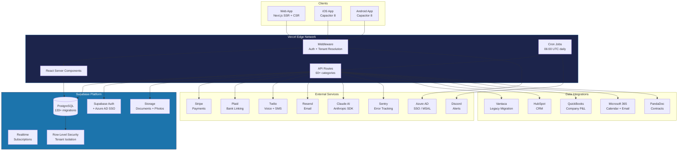
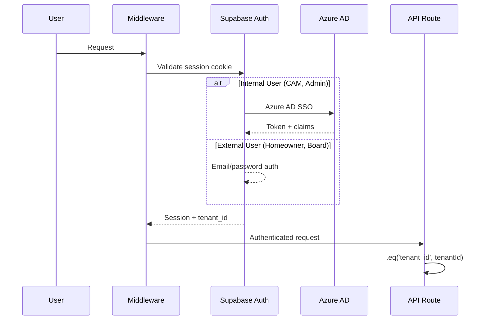

---
tags:
  - platform
  - architecture
  - tech-stack
  - engineering
aliases:
  - Architecture
  - Tech Stack
  - System Design
created: 2026-04-14
updated: 2026-04-14
---

# Architecture Overview

> [!info] Vera is a Next.js 16 monolith deployed on Vercel with Supabase (PostgreSQL) as the data layer. It serves as the internal operating system for [[Empire Management Group]] and [[Riance LLC Overview|Riance LLC]].

---

## System Architecture



---

## Tech Stack

| Layer | Technology | Version | Purpose |
|-------|-----------|---------|---------|
| **Framework** | Next.js | 16.2.0 | Full-stack React framework |
| **UI Library** | React | 19.2.3 | Component rendering |
| **Language** | TypeScript | 5.9.3 | Type safety |
| **Styling** | Tailwind CSS | v4 | Utility-first CSS |
| **Component Library** | shadcn/ui | 3.8.5 | Radix-based design system |
| **Charts** | Recharts | 3.8.1 | Data visualization |
| **Icons** | Lucide React | 0.577.0 | Icon library |
| **Database** | PostgreSQL (Supabase) | 2.98.0 | Primary data store |
| **Auth** | Supabase Auth + Azure AD | MSAL 5.0.6 | Authentication & SSO |
| **Payments** | Stripe | 20.4.1 | Payment processing |
| **Banking** | Plaid | 41.4.0 | Bank account linking |
| **Voice/SMS** | Twilio | 5.13.0 | Communications |
| **Email** | Resend | 6.10.0 | Transactional email |
| **AI** | Anthropic Claude | 0.78.0 | AI assistant (VeRAI) |
| **Documents** | ExcelJS + PDFKit | 4.4.0 / 0.18.0 | Report generation |
| **Forms** | React Hook Form + Zod | 7.71.2 / 4.3.6 | Validation |
| **Tables** | TanStack Table | 8.21.3 | Data tables |
| **Mobile** | Capacitor | 8.x | iOS + Android |
| **Monitoring** | Sentry | 10.48.0 | Error tracking |
| **Hosting** | Vercel | — | Edge deployment |
| **Maps** | Leaflet + Google Maps | — | Property mapping |

---

## Project Structure

```
vera/
├── src/
│   ├── app/                    # Next.js App Router
│   │   ├── api/                # 60+ API route categories
│   │   │   ├── accounting/     # AP, AR, GL, 1099s, fixed assets
│   │   │   ├── ai/             # Claude AI endpoints (VeRAI)
│   │   │   ├── associations/   # Community management (core)
│   │   │   ├── automation/     # 16 automation agents
│   │   │   ├── banking/        # Plaid, bank reconciliation
│   │   │   ├── board/          # Board meetings, votes, packets
│   │   │   ├── compliance/     # FL statute compliance
│   │   │   ├── cron/           # Scheduled job orchestrator
│   │   │   ├── crm/            # Sales pipeline, leads
│   │   │   ├── integrations/   # QuickBooks, Plaid, Apify
│   │   │   ├── stripe/         # Payment processing
│   │   │   ├── sync/           # Data sync (Paylocity, etc.)
│   │   │   └── ...             # 50+ more categories
│   │   ├── (dashboard)/        # Authenticated app routes
│   │   └── (public)/           # Public-facing routes
│   ├── components/             # 89 component directories, 582+ client components
│   ├── hooks/                  # Custom React hooks
│   └── lib/                    # Shared utilities
│       ├── auth/               # Auth helpers
│       ├── automation/         # Rules engine
│       ├── finance/            # Financial calculations
│       ├── integrations/       # External API clients
│       ├── security/           # Rate limiting, CSRF
│       ├── services/           # Business logic services
│       ├── supabase/           # DB client factories
│       ├── types/              # TypeScript type definitions
│       └── validation/         # Zod schemas
├── supabase/
│   └── migrations/             # 133+ SQL migration files
├── docs/                       # Documentation & architecture
└── public/                     # Static assets
```

---

## Key Architectural Patterns

### Multi-Tenant Isolation
Every Supabase query **must** include `.eq('tenant_id', tenantId)`. This is enforced at three levels:
1. **Application Layer** — All queries include tenant filter
2. **RLS Policies** — PostgreSQL row-level security as backstop
3. **Helper Function** — `public.get_tenant_id()` extracts tenant from JWT

See [[Database Schema]] and [[Security]] for details.

### Authentication Flow


### Money Handling
- All monetary values stored as **cents (integers)** — never floating point
- Double-entry accounting with balanced journal entries
- Constraints ensure `debit >= 0 AND credit >= 0` and exactly one is non-zero per line

### AI Integration (VeRAI)
Claude AI powers 15+ features via `/api/ai/verai/*`:
- Contract analysis, invoice extraction, violation photo analysis
- Meeting minutes, board summaries, financial insights
- Homeowner inquiry response, vendor compliance checking
- Legal summary, mediation drafting, scope of work generation

---

## Deployment

| Aspect | Details |
|--------|---------|
| **Platform** | Vercel (serverless) |
| **Build** | `next build` via Vercel CI |
| **Regions** | Edge functions, US-East primary |
| **Cron** | Vercel Cron, daily 06:00 UTC |
| **Monitoring** | Sentry (errors), Discord (automation alerts) |
| **Environment** | `.env.local` with Supabase, Stripe, Twilio, Resend keys |

---

## Testing

| Type | Tool | Coverage | Status |
|------|------|----------|--------|
| **Unit** | Vitest 4.1.2 | 0.8% (16 test files / 2,059 source) | Needs significant work |
| **E2E** | Playwright 1.59.1 | Minimal | In development |
| **Type Check** | `tsc --noEmit` | Full | Passing |
| **Lint** | ESLint | Full | Configured |

> [!warning] Test coverage is critically low at 0.8%. Priority areas for test addition: financial calculations, tenant isolation, auth boundaries. See the testing strategy for details.

---

*Related: [[Database Schema]] · [[API Routes]] · [[Automation Agents]] · [[Integrations]] · [[Security]]*
