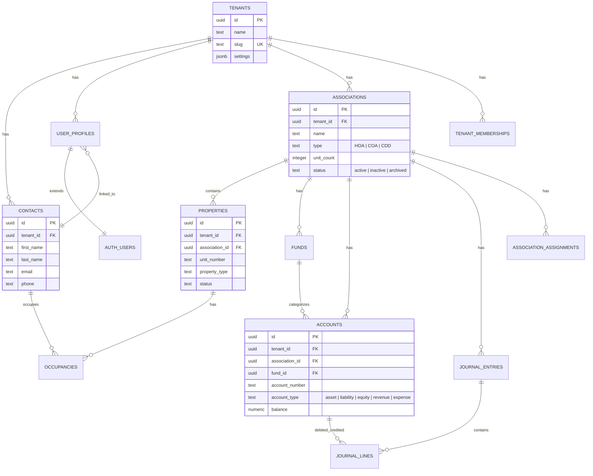

---
tags:
  - platform
  - database
  - schema
  - supabase
  - postgresql
aliases:
  - Schema
  - Database
  - DB Schema
created: 2026-04-14
updated: 2026-04-14
---

# Database Schema

> [!info] Vera uses Supabase (PostgreSQL) with 133+ migration files. The schema follows a multi-tenant pattern where every table includes a `tenant_id` foreign key and is protected by Row-Level Security (RLS).

---

## Entity Relationship Diagram (Core)



---

## Core Tables

### Tenancy & Auth (`001_tenants_and_auth.sql`)

| Table | Purpose | Key Columns |
|-------|---------|-------------|
| `tenants` | Top-level tenant (management company) | `id`, `name`, `slug`, `settings` |
| `contacts` | People (owners, vendors, board members) | `tenant_id`, `first_name`, `last_name`, `email`, `phone` |
| `user_profiles` | Authenticated user profiles | `tenant_id`, `contact_id`, `role`, `is_active` |
| `tenant_memberships` | User-to-tenant mapping (multi-tenant) | `user_id`, `tenant_id`, `role`, `is_default` |

### Communities & Properties (`002_associations_and_properties.sql`)

| Table | Purpose | Key Columns |
|-------|---------|-------------|
| `associations` | HOA/COA/CDD communities | `tenant_id`, `name`, `type`, `unit_count`, `status` |
| `properties` | Individual units/lots | `tenant_id`, `association_id`, `unit_number`, `property_type` |
| `occupancies` | Who lives where (owner/tenant) | `property_id`, `contact_id`, `occupancy_type`, `start_date` |
| `association_assignments` | CAM/staff assigned to communities | `association_id`, `user_id`, `role` |

### Financial Foundation (`003_financial_foundation.sql`)

| Table | Purpose | Key Columns |
|-------|---------|-------------|
| `funds` | Fund types per association | `association_id`, `fund_type` (operating/reserve/special) |
| `accounts` | Chart of accounts (per association) | `association_id`, `fund_id`, `account_number`, `account_type`, `balance` |
| `journal_entries` | Double-entry journal headers | `association_id`, `entry_date`, `status` (draft/posted/voided) |
| `journal_lines` | Individual debit/credit lines | `journal_entry_id`, `account_id`, `debit`, `credit` |

> [!tip] Journal line constraints enforce proper double-entry: `debit >= 0`, `credit >= 0`, at least one non-zero, and never both non-zero on the same line.

---

## Migration History (133+ files)

### Migration Ranges

| Range | Domain | Key Tables |
|-------|--------|------------|
| `001-006` | Core foundation | tenants, contacts, associations, properties, funds, accounts, journal entries |
| `007-012` | Financial expansion | assessments, invoices, payment plans, bank accounts |
| `013-019` | Security & operations | audit logs, inspections, amenities, late fees |
| `020-030` | CRM & compliance | leads, contracts, inventory, payroll, SSO |
| `031-060` | Features buildout | violations, work orders, elections, surveys |
| `061-090` | Advanced modules | vendor management, POS, marina, golf, insurance |
| `091-110` | Compliance & workflows | resolution votes, renter insurance, compliance counties |
| `111-125` | Full platform | settings, websites, global search, fund accounting, banking |
| `126-134` | Recent additions | tagging, intake, meeting recordings, soft deletes, triggers |

---

## Multi-Tenant Pattern

### The Golden Rule

> [!warning] Every Supabase query MUST include `.eq('tenant_id', tenantId)`. No exceptions.

```typescript
// CORRECT - always filter by tenant
const { data } = await supabase
  .from('associations')
  .select('*')
  .eq('tenant_id', tenantId)
  .eq('status', 'active')

// WRONG - missing tenant filter (security violation)
const { data } = await supabase
  .from('associations')
  .select('*')
  .eq('status', 'active')
```

### Tenant Resolution

```sql
-- Helper function extracts tenant_id from JWT or user profile
CREATE OR REPLACE FUNCTION public.get_tenant_id()
RETURNS UUID AS $$
    SELECT COALESCE(
        (current_setting('request.jwt.claims', true)::json->>'tenant_id')::uuid,
        (SELECT tenant_id FROM public.user_profiles WHERE id = auth.uid())
    );
$$ LANGUAGE sql STABLE SECURITY DEFINER;
```

### RLS Pattern

Every table has RLS policies following this pattern:
```sql
ALTER TABLE public.associations ENABLE ROW LEVEL SECURITY;

CREATE POLICY "tenant_isolation" ON public.associations
    USING (tenant_id = public.get_tenant_id());
```

See [[Security]] for the full RLS and access control documentation.

---

## Key Indexes

All tables include these standard indexes:
- `idx_{table}_tenant_id` — Tenant isolation queries
- `idx_{table}_association_id` — Community-scoped queries (where applicable)
- `idx_{table}_created_at` — Time-series queries
- `idx_{table}_status` — Status filtering

---

## Data Types & Conventions

| Convention | Rule |
|-----------|------|
| **Primary Keys** | UUID (`gen_random_uuid()`) |
| **Timestamps** | `TIMESTAMPTZ` with `DEFAULT now()` |
| **Money** | `NUMERIC(14,2)` in database, cents (integers) in application code |
| **Status Fields** | `TEXT` with `CHECK` constraints for valid values |
| **Soft Deletes** | `deleted_at TIMESTAMPTZ` (migration 133) |
| **Audit** | `created_at`, `updated_at` on every table (triggers in migration 134) |
| **Foreign Keys** | `ON DELETE CASCADE` for dependent data, `SET NULL` for optional refs |

---

*Related: [[Architecture Overview]] · [[Security]] · [[API Routes]]*
