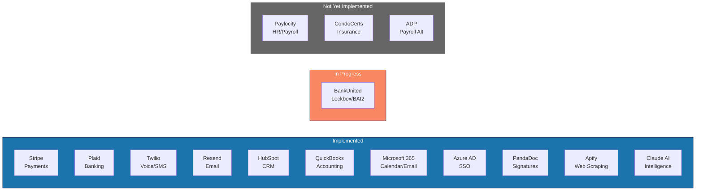

---
tags:
  - platform
  - integrations
  - third-party
  - api
aliases:
  - Integrations
  - Third-Party
  - External Systems
created: 2026-04-14
updated: 2026-04-14
---

# Integrations

> [!info] Vera integrates with 12+ external systems. Some are fully implemented, others are in progress or planned. This document tracks the status and purpose of each.

---

## Integration Status Overview

---

## Payments & Banking

### Stripe
| Field | Details |
|-------|---------|
| **Status** | Implemented |
| **SDK** | `stripe` v20.4.1 |
| **Purpose** | Online payment processing, POS, subscriptions |
| **Features** | Payment intents, webhooks, customer management, refunds |
| **Routes** | `/api/stripe/*`, `/api/webhooks/stripe` |
| **PCI** | Compliant — Stripe handles all card data |

### Plaid
| Field | Details |
|-------|---------|
| **Status** | Implemented |
| **SDK** | `plaid` v41.4.0 |
| **Purpose** | Bank account linking, balance verification, transaction feeds |
| **Features** | Link tokens, account verification, transaction sync |
| **Routes** | `/api/integrations/plaid/*` |

### BankUnited
| Field | Details |
|-------|---------|
| **Status** | In Progress |
| **Purpose** | Lockbox payments, BAI2 bank feeds, ACH origination, check images |
| **File Formats** | BAI2 (daily), NACHA (outbound ACH), lockbox CSV/TXT |
| **Details** | See `docs/INTEGRATION_SPECS.md` for complete file format specs |

---

## Communications

### Twilio
| Field | Details |
|-------|---------|
| **Status** | Implemented |
| **SDK** | `twilio` v5.13.0 |
| **Purpose** | Voice calls (AI call center), SMS/text blasts |
| **Features** | Inbound/outbound calls, text messaging, call recording |
| **Routes** | `/api/communications/*`, `/api/text-blasts/*` |

### Resend
| Field | Details |
|-------|---------|
| **Status** | Implemented |
| **SDK** | `resend` v6.10.0 |
| **Purpose** | Transactional email, bulk email campaigns |
| **Features** | Template-based emails, attachments, delivery tracking |
| **Routes** | `/api/communications/*` |

---

## CRM & Business

### HubSpot
| Field | Details |
|-------|---------|
| **Status** | Implemented |
| **Purpose** | CRM, sales pipeline, lead management |
| **Integration** | MCP tool (`mcp__claude_ai_HubSpot__*`) + direct API |
| **Sync** | Contacts, deals, companies bidirectional |

### QuickBooks
| Field | Details |
|-------|---------|
| **Status** | Implemented |
| **Purpose** | Company-level P&L (reference import, not primary GL) |
| **Integration** | MCP tool (`mcp__claude_ai_Intuit_QuickBooks__*`) + `/api/integrations/quickbooks/*` |
| **Direction** | Read-only from QBO into Vera |

### PandaDoc
| Field | Details |
|-------|---------|
| **Status** | Implemented |
| **Purpose** | Contract management, e-signatures |
| **Routes** | `/api/signatures/*` |

---

## Identity & Productivity

### Azure AD (Microsoft Entra ID)
| Field | Details |
|-------|---------|
| **Status** | Implemented |
| **SDK** | `@azure/msal-node` v5.0.6 |
| **Purpose** | SSO for internal users (CAMs, accounting, admin) |
| **Flow** | OAuth 2.0 authorization code flow |
| **Scope** | Internal employees only; external users use email/password |

### Microsoft 365
| Field | Details |
|-------|---------|
| **Status** | Implemented |
| **SDK** | `@microsoft/microsoft-graph-client` v3.0.7 |
| **Purpose** | Calendar sync, email integration |
| **Integration** | MCP tool (`mcp__claude_ai_Microsoft_365__*`) + Graph API |

---

## AI & Intelligence

### Claude AI (Anthropic)
| Field | Details |
|-------|---------|
| **Status** | Implemented |
| **SDK** | `@anthropic-ai/sdk` v0.78.0 |
| **Purpose** | VeRAI assistant — 15+ AI-powered features |
| **Features** | Contract analysis, invoice extraction, violation photo analysis, meeting minutes, financial insights, homeowner inquiry response, legal summaries |
| **Routes** | `/api/ai/*`, `/api/ai/verai/*` |

### Apify
| Field | Details |
|-------|---------|
| **Status** | Implemented |
| **Purpose** | Web scraping for competitive intelligence, property data enrichment |
| **Routes** | `/api/integrations/apify/*` |

---

## Legacy / Migration

### Vantaca
| Field | Details |
|-------|---------|
| **Status** | Migration in progress |
| **Purpose** | Legacy community management system being replaced by Vera |
| **Strategy** | Full data migration; Vantaca becomes read-only then retired |
| **Sync** | `/sync-vantaca` skill for data import |

> [!warning] Vantaca is the system of record until migration is complete. Any data discrepancy should be resolved in favor of Vantaca data until full cutover.

---

## Planned (Not Yet Implemented)

### Paylocity
| Field | Details |
|-------|---------|
| **Status** | Planned (Phase 4) |
| **Purpose** | HR/payroll integration |
| **Current** | Stub route at `/api/sync/paylocity` |

### CondoCerts
| Field | Details |
|-------|---------|
| **Status** | Planned |
| **Purpose** | Insurance certificate management |
| **Current** | Vera's certificate module will replace CondoCerts |

---

## Monitoring

### Sentry
| Field | Details |
|-------|---------|
| **Status** | Implemented |
| **SDK** | `@sentry/nextjs` v10.48.0 |
| **Purpose** | Error tracking, performance monitoring |

### Discord
| Field | Details |
|-------|---------|
| **Status** | Implemented |
| **Purpose** | Automation alerts, agent reports, failure notifications |
| **Config** | `DISCORD_WEBHOOK_URL` environment variable |

---

*Related: [[Architecture Overview]] · [[Security]] · [[API Routes]] · [[Automation Agents]]*
