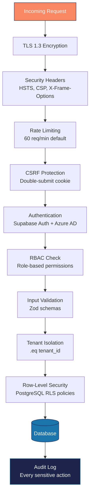

---
tags:
  - platform
  - security
  - rls
  - authentication
  - compliance
aliases:
  - Security
  - Auth
  - Access Control
created: 2026-04-14
updated: 2026-04-14
---

# Security

> [!info] Vera implements defense-in-depth security: authentication via Supabase Auth + Azure AD, authorization via RLS + RBAC, encryption in transit (TLS 1.3) and at rest, rate limiting, input validation, and comprehensive audit logging.

---

## Security Layers



---

## Authentication

### Internal Users (Employees)
- **Method**: Azure AD SSO via MSAL (`@azure/msal-node` v5.0.6)
- **Flow**: OAuth 2.0 authorization code
- **MFA**: Enforced via Azure AD policies
- **Session**: HTTP-only secure cookies

### External Users (Homeowners, Board, Vendors)
- **Method**: Email/password via Supabase Auth
- **Requirements**: Minimum 12 characters, complexity rules
- **Session**: HTTP-only secure cookies with Supabase SSR

### Session Management
- HTTP-only cookies (not accessible via JavaScript)
- Secure flag (HTTPS only)
- SameSite=Lax
- Automatic refresh token rotation

---

## Authorization (RBAC)

### Role Hierarchy

| Role | Scope | Access Level |
|------|-------|-------------|
| `super_admin` | All tenants | Full system access |
| `executive` | Portfolio-wide | Read + oversight, no operational edit |
| `director` | Multi-office portfolio | Team management, community oversight |
| `manager` (CAM) | Assigned communities | Full operational access |
| `accounting` | Financial modules | AP/AR, ledger, reports |
| `hr` | Workforce modules | Payroll, time tracking |
| `call_center` | Inbox/calls | Action item creation, homeowner lookup |
| `board_member` | Own community | Meetings, approvals, financials, docs |
| `homeowner` | Own unit | Balance, work orders, ARC, violations |
| `vendor` | Assigned work orders | Job updates, invoices, COI |

### Permission Dimensions

Permissions are evaluated on **four axes**:
```
PERMISSION = role x portfolio x community x entity_scope
```

See [[Architecture Overview]] for the full permission matrix.

---

## Multi-Tenant Isolation

### Application Layer
Every Supabase query includes `.eq('tenant_id', tenantId)`:

```typescript
// All queries MUST include tenant filter
const { data } = await supabase
  .from('associations')
  .select('*')
  .eq('tenant_id', tenantId)
```

### Database Layer (RLS)
PostgreSQL Row-Level Security as defense-in-depth:

```sql
-- Tenant ID extracted from JWT
CREATE OR REPLACE FUNCTION public.get_tenant_id()
RETURNS UUID AS $$
    SELECT COALESCE(
        (current_setting('request.jwt.claims', true)::json->>'tenant_id')::uuid,
        (SELECT tenant_id FROM public.user_profiles WHERE id = auth.uid())
    );
$$ LANGUAGE sql STABLE SECURITY DEFINER;

-- Applied to every table
ALTER TABLE public.associations ENABLE ROW LEVEL SECURITY;
CREATE POLICY "tenant_isolation" ON public.associations
    USING (tenant_id = public.get_tenant_id());
```

> [!warning] RLS is the **last line of defense**. The application layer filter is the primary mechanism. Never rely solely on RLS — always include `.eq('tenant_id', tenantId)` in application code.

---

## Network Security

| Protection | Implementation |
|-----------|----------------|
| **HTTPS Only** | TLS 1.3 via Vercel |
| **HSTS** | `Strict-Transport-Security` enforced |
| **CSP** | Content-Security-Policy header |
| **X-Frame-Options** | `DENY` (clickjacking protection) |
| **X-Content-Type-Options** | `nosniff` (MIME sniffing) |
| **X-XSS-Protection** | `1; mode=block` |
| **Referrer-Policy** | `strict-origin-when-cross-origin` |

---

## Rate Limiting

| Endpoint Type | Limit | Window |
|---------------|-------|--------|
| API routes | 60 req | 1 min |
| Auth routes | 5 req | 1 min |
| Webhooks | 100 req | 1 min |
| File uploads | 10 req | 1 min |

```typescript
import { rateLimiters } from '@/lib/security/rate-limiter'

export const POST = withRateLimit(rateLimiters.api, async (req) => {
  // Handler
})
```

---

## Input Validation

All API inputs validated with Zod schemas before processing:

```typescript
import { z } from 'zod'

const CreateAssociationSchema = z.object({
  name: z.string().min(1).max(255),
  type: z.enum(['HOA', 'COA', 'CDD']),
  // ...
})
```

- SQL injection prevention: parameterized queries only (Supabase client)
- XSS prevention: React auto-escaping + CSP
- CSRF: Double-submit cookie pattern

---

## Data Protection

| Area | Method |
|------|--------|
| **Encryption at rest** | PostgreSQL encryption (Supabase managed) |
| **Encryption in transit** | TLS 1.3 |
| **PII handling** | Minimal collection, encrypted storage |
| **Payment data** | PCI-compliant via Stripe (no card data stored) |
| **API keys** | Environment variables, never in code |
| **Key rotation** | Regular rotation enforced (see `docs/STRIPE_KEY_ROTATION.md`) |

---

## Webhook Security

All inbound webhooks validated:
- **Stripe**: Signature verification via `stripe.webhooks.constructEvent()`
- **Twilio**: Request validation via Twilio signature
- **Others**: HMAC signature verification

---

## Audit Logging

Every sensitive action logged to `audit_events`:

| Field | Description |
|-------|-------------|
| `user_id` | Who performed the action |
| `action` | What was done (create, update, delete, approve, etc.) |
| `entity_type` | What type of record |
| `entity_id` | Which specific record |
| `tenant_id` | Which tenant |
| `ip_address` | Where the request came from |
| `metadata` | Additional context (JSONB) |
| `created_at` | When |

---

## Automation Security

- All automation endpoints require `AUTOMATION_SECRET` header
- Cron jobs triggered only by Vercel's cron infrastructure
- Agent actions logged to audit trail
- Discord alerts on any failure

---

*Related: [[Architecture Overview]] · [[Database Schema]] · [[Incident Response]] · [[Daily Runbook]]*
