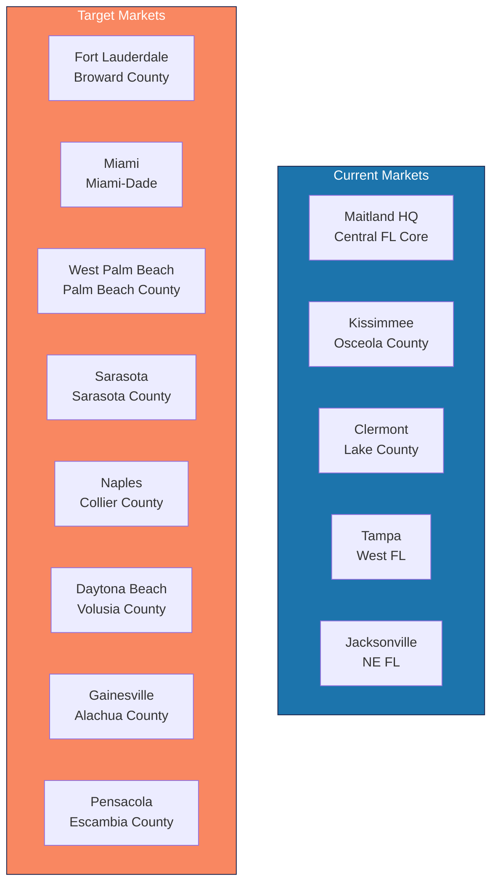

---
tags:
  - strategy
  - expansion
  - markets
  - florida
aliases:
  - Markets
  - FL Expansion
  - Target Markets
created: 2026-04-14
updated: 2026-04-14
---

# Expansion Markets

> [!info] [[Empire Management Group]] currently operates in Central Florida with offices in Maitland (HQ), Kissimmee, Clermont, Tampa, and Jacksonville. This document maps 8 target expansion markets within Florida.

---

## Current Footprint

---

## Target Market Analysis

### Tier 1 — High Priority (Near-term)

#### 1. Fort Lauderdale / Broward County
| Factor | Details |
|--------|---------|
| **HOA/COA Density** | Very High — dense condo market |
| **Estimated Communities** | 5,000+ |
| **Competition** | Heavy — FirstService, Associa, Castle Group |
| **Why Now** | SB 4D driving management changes; firms overwhelmed |
| **Entry Strategy** | Hire 2-3 experienced CAMs from region; target 20-30 communities |
| **Revenue Potential** | $1-2M within 18 months |

#### 2. Miami / Miami-Dade
| Factor | Details |
|--------|---------|
| **HOA/COA Density** | Highest in FL — massive condo market |
| **Estimated Communities** | 10,000+ |
| **Competition** | Extremely competitive; fragmented |
| **Why Now** | Surfside aftermath; SB 4D compliance demand; bilingual advantage |
| **Entry Strategy** | Partner with local firm or acquire; bilingual staff essential |
| **Revenue Potential** | $2-5M within 24 months |
| **Risk** | High competition, bilingual requirement, complex market |

#### 3. West Palm Beach / Palm Beach County
| Factor | Details |
|--------|---------|
| **HOA/COA Density** | High — affluent communities with larger budgets |
| **Estimated Communities** | 3,000+ |
| **Competition** | Moderate — fewer national players than Miami |
| **Why Now** | Growing market, tech-savvy boards |
| **Entry Strategy** | Target premium communities willing to pay for technology |
| **Revenue Potential** | $1-2M within 18 months |

---

### Tier 2 — Medium Priority (6-12 months)

#### 4. Sarasota / Manatee
| Factor | Details |
|--------|---------|
| **HOA/COA Density** | High — retirement/55+ communities |
| **Estimated Communities** | 2,000+ |
| **Competition** | Moderate |
| **Entry Strategy** | Extension of Tampa office; shared resources |
| **Revenue Potential** | $500K-1M within 18 months |

#### 5. Naples / Collier County
| Factor | Details |
|--------|---------|
| **HOA/COA Density** | High — premium communities, high per-door fees |
| **Estimated Communities** | 1,500+ |
| **Competition** | Moderate; local firms dominate |
| **Entry Strategy** | Target luxury communities; premium service tier |
| **Revenue Potential** | $500K-1.5M within 18 months |

#### 6. Daytona Beach / Volusia County
| Factor | Details |
|--------|---------|
| **HOA/COA Density** | Moderate — beachfront condos + suburban HOAs |
| **Estimated Communities** | 800+ |
| **Competition** | Low — underserved market |
| **Entry Strategy** | Extension of Central FL operations; easy commute |
| **Revenue Potential** | $300-500K within 18 months |

---

### Tier 3 — Long-term (12-24 months)

#### 7. Gainesville / Alachua County
| Factor | Details |
|--------|---------|
| **HOA/COA Density** | Low-Moderate |
| **Estimated Communities** | 300+ |
| **Competition** | Very low — underserved |
| **Entry Strategy** | Remote management initially; satellite office if volume justifies |
| **Revenue Potential** | $200-400K within 24 months |

#### 8. Pensacola / NW Florida
| Factor | Details |
|--------|---------|
| **HOA/COA Density** | Moderate — beachfront communities |
| **Estimated Communities** | 500+ |
| **Competition** | Low |
| **Entry Strategy** | Remote management; explore acquisition of local firm |
| **Revenue Potential** | $300-500K within 24 months |

---

## Market Entry Checklist

- [ ] Market research: community count, competitor mapping, pricing analysis
- [ ] Recruit: 2-3 licensed CAMs from the target market
- [ ] Office space: co-working initially, dedicated office at 30+ communities
- [ ] Licensing: confirm CAM licensing reciprocity within FL (no state-level issue)
- [ ] Marketing: targeted outreach to boards, attend local FLCAJ events
- [ ] Technology: Vera is geography-agnostic (no tech changes needed)
- [ ] Pricing: set per-door pricing competitive with local market

---

## Revenue Projection by Market

| Market | Year 1 | Year 2 | Cumulative |
|--------|--------|--------|-----------|
| Fort Lauderdale | $800K | $1.5M | $2.3M |
| Miami | $1M | $3M | $4M |
| West Palm Beach | $700K | $1.5M | $2.2M |
| Sarasota | $400K | $800K | $1.2M |
| Naples | $400K | $1M | $1.4M |
| Daytona Beach | $200K | $400K | $600K |
| Gainesville | $100K | $300K | $400K |
| Pensacola | $150K | $350K | $500K |
| **Total New Market Revenue** | **$3.75M** | **$8.85M** | **$12.6M** |

---

*Related: [[Empire Management Group]] · [[Growth Opportunities]] · [[Multi-State Expansion]] · [[Competitive Landscape]]*
