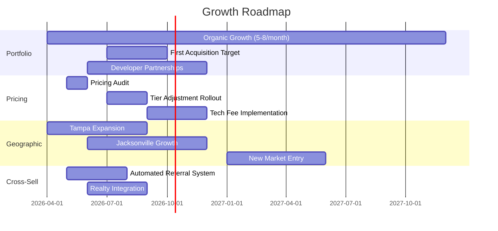

---
tags:
  - strategy
  - growth
  - revenue
  - risk
aliases:
  - Growth
  - Revenue Growth
  - Strategic Opportunities
created: 2026-04-14
updated: 2026-04-14
---

# Growth Opportunities

> [!info] This document maps the strategic growth opportunities for [[Riance LLC Overview|Riance LLC]] and [[Empire Management Group]], analyzing revenue concentration risk, pricing optimization, geographic expansion, and new revenue streams.

---

## Current Revenue Concentration Risk

> [!warning] **Critical Risk**: EMG represents 68% of Riance revenue. A loss of 10 large communities (4% of portfolio) could reduce total revenue by 5-8%. Diversification is essential.

| Risk Factor | Current State | Mitigation |
|-------------|--------------|------------|
| EMG revenue dominance | 68% of total | Grow Realty, WFW, FixIQ |
| Geographic concentration | Central FL only | Expand to 8 target markets |
| Top-10 community dependency | ~15-20% of EMG revenue | Grow pipeline, reduce per-client concentration |
| Single-state regulatory risk | FL only | Multi-state expansion (see [[Multi-State Expansion]]) |

---

## Revenue Growth Levers

### 1. Portfolio Growth (More Communities)

| Target | Current | Goal (2027) | Revenue Impact |
|--------|---------|-------------|---------------|
| Communities | 255 | 400 | +$4.5M |
| Doors | 28,391 | 45,000 | Aligned |

**Strategy:**
- Organic sales: 5-8 new communities/month (see [[Expansion Markets]])
- Acquisitions: Acquire 1-2 small management companies per year
- Developer partnerships: Secure management contracts for new construction
- Cross-company referrals: [[Riance Realty]] developer relationships

### 2. Pricing Optimization

| Tier | Current Avg/Door | Market Avg | Opportunity |
|------|-----------------|------------|-------------|
| Small (10-50) | ~$30/door | $35-45/door | +$5-15/door |
| Medium (51-200) | ~$22/door | $25-30/door | +$3-8/door |
| Large (201-500) | ~$18/door | $20-25/door | +$2-7/door |
| XL/CDD (500+) | ~$12/door | $15-18/door | +$3-6/door |

See [[Pricing Benchmarks]] for detailed analysis.

> [!tip] A $3/door increase across the entire portfolio of 28,391 doors = ~$85K additional annual revenue with zero acquisition cost.

### 3. Technology Fee Revenue

| Fee Type | Current | Proposed | Revenue |
|----------|---------|----------|---------|
| Portal access fee | $0 | $2/door/month | $681K/year |
| Online payment convenience fee | Absorbed | $3/transaction | Variable |
| Estoppel fee | $250 flat | $250-500 (rush premium) | Incremental |
| Document retrieval | Free | $15-25/request | Variable |

### 4. Ancillary Service Revenue

See [[New Revenue Streams]] for 8 potential services with estimates.

### 5. Cross-Company Revenue

See [[Cross-Sell Matrix]] for inter-company revenue flow analysis. Largest untapped opportunity: **EMG to Riance Realty** ($500K-1M potential).

---

## Growth Timeline

---

## Competitive Moats to Build

1. **Technology Platform** — Vera as the operating system no competitor can match
2. **Data Network Effects** — More communities = better benchmarks, better AI
3. **Ecosystem Lock-in** — [[Cross-Sell Matrix|Four companies]] serving every need
4. **Florida Compliance Depth** — No one knows FL HOA law implementation better
5. **AI-Powered Service** — VeRAI reduces CAM workload, improves service quality

---

## Key Metrics to Track

| Metric | Current | Target | Timeline |
|--------|---------|--------|----------|
| Total communities | 255 | 400 | 18 months |
| Total doors | 28,391 | 45,000 | 18 months |
| EMG revenue | $7.71M | $12M | 18 months |
| Riance total revenue | $11.34M | $18M | 18 months |
| Revenue per door | ~$271/year | $300+/year | 12 months |
| Client retention rate | ~95% (est) | 98% | 12 months |
| Cross-sell capture rate | ~15% | 40% | 12 months |

---

*Related: [[Riance LLC Overview]] · [[Empire Management Group]] · [[Expansion Markets]] · [[New Revenue Streams]] · [[Pricing Benchmarks]] · [[Cross-Sell Matrix]] · [[Competitive Landscape]]*
