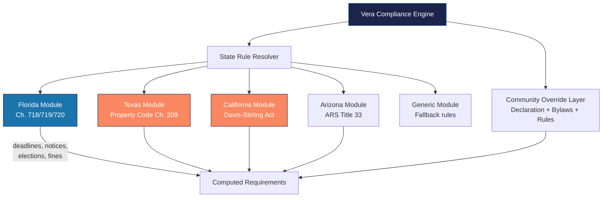

---
tags:
  - strategy
  - expansion
  - multi-state
  - regulatory
aliases:
  - Multi-State
  - State Expansion
  - National Expansion
created: 2026-04-14
updated: 2026-04-14
---

# Multi-State Expansion

> [!info] Vera's statutory compliance engine is currently Florida-only. This document maps the path to multi-state expansion, analyzing regulatory requirements, market size, and implementation complexity for each target state.

---

## State Tier Rankings

### Tier 1 — Expand First (Largest HOA markets, most similar to FL)

| State | HOA Communities | Key Statute | Complexity | Market Size |
|-------|----------------|-------------|------------|-------------|
| **Texas** | 80,000+ | TX Property Code Ch. 209 | Medium | Largest US HOA market |
| **California** | 55,000+ | Davis-Stirling Act (Civ. Code 4000-6150) | High | Dense condo market; complex regs |
| **Arizona** | 10,000+ | ARS Title 33, Ch. 16 | Medium | Fast-growing; HOA-friendly state |

### Tier 2 — High Opportunity (Strong HOA markets)

| State | HOA Communities | Key Statute | Complexity | Market Size |
|-------|----------------|-------------|------------|-------------|
| **Nevada** | 3,500+ | NRS 116 (CIC Act) | High | Very regulated; ombudsman office |
| **Colorado** | 10,000+ | CCIOA (CO Common Interest Ownership Act) | Medium | Growing market; Denver metro |
| **North Carolina** | 15,000+ | NC Planned Community Act (47F) | Low | Fast-growing; lighter regulation |
| **Georgia** | 8,000+ | GA Property Owners' Association Act | Low | Atlanta metro; lighter regulation |

### Tier 3 — Long-term (Specialized markets)

| State | HOA Communities | Key Statute | Complexity | Market Size |
|-------|----------------|-------------|------------|-------------|
| **Illinois** | 5,000+ | Condo Property Act (765 ILCS 605) | High | Chicago metro focus |
| **New York** | 3,000+ | Multiple (condo, co-op distinct) | Very High | Co-ops dominate; unique market |
| **Washington** | 5,000+ | WUCIOA (64.90 RCW) | Medium | Seattle metro; growing |

---

## Vera Platform Requirements

### Current Architecture (FL-only)

The statutory compliance engine currently hard-codes Florida timelines:
- Violation escalation: FL FS 720.305 timelines
- Collection process: FL FS 720.3085 deadlines
- Election rules: FL-specific proxy and voting rules
- Notice requirements: FL-specific content and delivery rules

### Target Architecture (Pluggable by State)

### Implementation Plan

| Phase | Scope | Timeline | Effort |
|-------|-------|----------|--------|
| **Phase 1** | Refactor FL rules into pluggable module | 4-6 weeks | Medium |
| **Phase 2** | Build state rule resolver + configuration system | 4-6 weeks | Medium |
| **Phase 3** | TX module (Property Code Ch. 209) | 6-8 weeks | High (attorney review) |
| **Phase 4** | CA module (Davis-Stirling Act) | 8-12 weeks | Very High (complex law) |
| **Phase 5** | AZ, NV, CO modules | 4-6 weeks each | Medium per state |

---

## State-Specific Considerations

### Texas (Tier 1)

| Area | FL Approach | TX Difference |
|------|-----------|---------------|
| **Violations** | 14-day cure period | Varies by community; no state-mandated cure period |
| **Collections** | Intent to lien + 45-day wait | Assessment lien is automatic (no notice required for some) |
| **Elections** | Specific proxy rules (FS 720.306) | Less regulated; bylaws control |
| **Fining** | $1,000 max per violation | No statutory cap; community-set |
| **Licensing** | CAM license required | No state CAM license requirement |

### California (Tier 1)

| Area | FL Approach | CA Difference |
|------|-----------|---------------|
| **Violations** | FS 720.305 process | IDR (Internal Dispute Resolution) + ADR required before enforcement |
| **Collections** | FS 720.3085 lien process | Pre-lien notice required; assessment amounts affect lien type |
| **Elections** | FS 720.306 | CA Civ. Code 5100-5145; secret ballot required; inspector of elections |
| **Meetings** | 14-day notice | Open Meeting Act; 4-day notice for board; 10-30 day for annual |
| **Fining** | $1,000 max | No statutory cap; reasonableness standard |

> [!warning] California's Davis-Stirling Act is the most complex HOA statute in the US. Full compliance implementation requires extensive attorney review and will take 8-12 weeks.

### Arizona (Tier 1)

| Area | FL Approach | AZ Difference |
|------|-----------|---------------|
| **Violations** | 14-day cure | Notice + reasonable time to cure |
| **Collections** | Intent to lien notice | Lien is automatic on recording; different notice requirements |
| **Elections** | FL-specific | Specific ballot procedures; cumulative voting common |
| **Meetings** | 14-day notice | 48-hour notice for board meetings; 10-50 day for annual |

---

## Resource Requirements per State

| Resource | Cost | Timeline |
|----------|------|----------|
| **Legal review** (per state) | $15-30K | 4-8 weeks |
| **Engineering** (state module) | 4-8 weeks of engineering time | Per state |
| **CAM licensing** | Varies ($0-2K per person) | Some states don't require |
| **Local office** | $3-5K/month rent | When volume justifies |
| **Local hire** | $60-80K/year per CAM | 2-3 per new market |

---

## Go/No-Go Criteria

Before entering a new state, evaluate:

- [ ] Legal: Attorney review of state HOA statutes complete
- [ ] Technology: State module built, tested, and deployed in Vera
- [ ] Personnel: Licensed CAMs (where required) hired or identified
- [ ] Market: Minimum 50 target communities identified
- [ ] Competition: Competitive analysis for the specific market done
- [ ] Financial: Break-even achievable within 18 months

---

*Related: [[Growth Opportunities]] · [[Expansion Markets]] · [[Competitive Landscape]] · [[Florida HOA Compliance]] · [[Architecture Overview]]*
