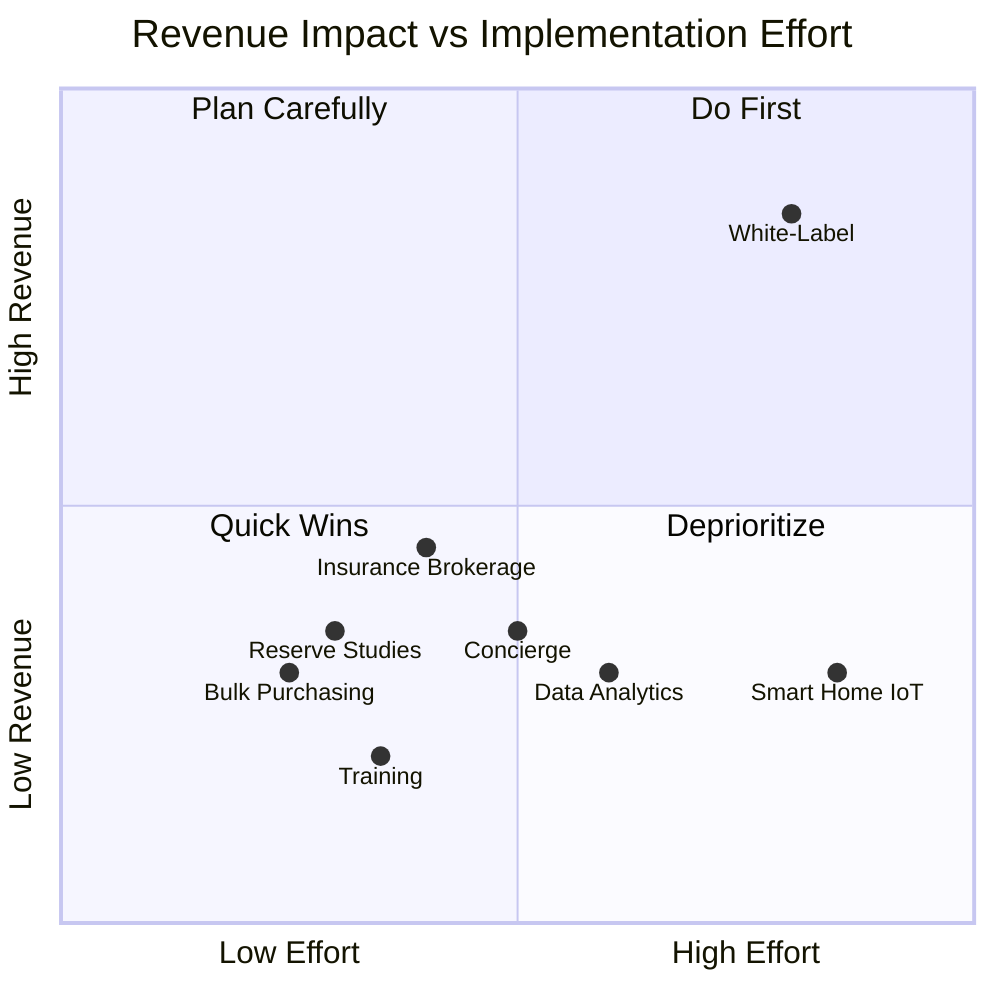

---
tags:
  - strategy
  - revenue
  - new-services
  - growth
aliases:
  - New Revenue
  - Additional Services
created: 2026-04-14
updated: 2026-04-14
---

# New Revenue Streams

> [!info] Beyond portfolio growth and pricing optimization, these 8 new services represent additional revenue opportunities for [[Riance LLC Overview|Riance LLC]] that leverage the existing community base and [[Architecture Overview|Vera platform]].

---

## Revenue Stream Summary

| # | Service | Est. Annual Revenue | Investment | Timeline | Risk |
|---|---------|-------------------|------------|----------|------|
| 1 | White-Label Platform | $500K-2M | High | 12-18 months | Medium |
| 2 | Insurance Brokerage | $300-500K | Medium | 6-9 months | Low |
| 3 | Reserve Study Services | $200-400K | Low | 3-6 months | Low |
| 4 | Bulk Purchasing Program | $150-300K | Low | 3-6 months | Low |
| 5 | Training & Certification | $100-200K | Low | 6 months | Low |
| 6 | Concierge Services | $200-400K | Medium | 6-12 months | Medium |
| 7 | Smart Home / IoT | $150-300K | High | 12-18 months | High |
| 8 | Data & Analytics Licensing | $100-300K | Medium | 12 months | Medium |

---

## Detailed Analysis

### 1. White-Label Platform Licensing

> [!tip] This is the highest-potential revenue stream. Vera could become the infrastructure layer for other management companies.

| Factor | Details |
|--------|---------|
| **Description** | License Vera to other management companies with their branding |
| **Revenue Model** | $2-5/door/month + setup fee ($5-25K) |
| **Target Market** | Small/mid-size management companies (50-200 communities) |
| **Requirements** | Multi-tenant architecture (already built), white-label theming, self-service onboarding |
| **Competitor** | AppFolio, Buildium (but not HOA-specific) |
| **Moat** | Florida statutory compliance engine is nearly impossible to replicate |

### 2. Insurance Brokerage

| Factor | Details |
|--------|---------|
| **Description** | Offer master policy, D&O, fidelity, and umbrella insurance to managed communities |
| **Revenue Model** | Commission on premiums (10-15%) |
| **Current State** | Communities source insurance independently |
| **Advantage** | 255 communities = bulk negotiating power; [[Wind Fire Water\|WFW]] provides claims management |
| **Requirement** | Insurance broker license or partnership with licensed broker |

### 3. Reserve Study Services

| Factor | Details |
|--------|---------|
| **Description** | Conduct reserve studies for managed communities (and external clients) |
| **Revenue Model** | $3-8K per study, recurring every 3-5 years |
| **Current State** | Communities hire third-party reserve study firms |
| **Advantage** | Already have property data, financial history, maintenance records in Vera |
| **Requirement** | Partner with or hire licensed reserve study specialist |

### 4. Bulk Purchasing Program

| Factor | Details |
|--------|---------|
| **Description** | Negotiate bulk rates for common HOA expenses (landscaping, pool, pest, painting) |
| **Revenue Model** | Vendor rebates (5-10% of spend) or markup |
| **Current State** | Each community negotiates independently |
| **Advantage** | 255 communities = significant purchasing power |
| **Requirement** | Vendor network, contract management via Vera |

### 5. Training & Certification

| Factor | Details |
|--------|---------|
| **Description** | Offer CAM training, board member certification, and compliance education |
| **Revenue Model** | $99-299/course; $499-999/certification program |
| **Current State** | Board members lack training resources |
| **Advantage** | Florida requires board member certification; Vera content already exists |
| **Requirement** | Course content development, LMS integration or portal module |

### 6. Concierge Services

| Factor | Details |
|--------|---------|
| **Description** | Premium homeowner services — package pickup, key holding, move coordination |
| **Revenue Model** | $5-15/door/month (opt-in by community) |
| **Target** | Luxury condos and active adult communities |
| **Advantage** | Differentiator vs. competitors; integrated into Vera portal |
| **Requirement** | Staff or contractor network in each market |

### 7. Smart Home / IoT Integration

| Factor | Details |
|--------|---------|
| **Description** | Community-level IoT (gate access, cameras, environmental monitoring) |
| **Revenue Model** | Hardware markup + $3-5/door/month monitoring |
| **Target** | Communities upgrading security and access control |
| **Advantage** | Vera already has access control API; natural extension |
| **Requirement** | Hardware partnerships, installation network |
| **Risk** | High capital requirements, hardware support burden |

### 8. Data & Analytics Licensing

| Factor | Details |
|--------|---------|
| **Description** | Anonymized benchmarking data for industry reports, insurance underwriting, real estate valuations |
| **Revenue Model** | Subscription to analytics platform or data feeds |
| **Target** | Insurance companies, real estate firms, industry associations |
| **Advantage** | 255 communities of financial and operational data |
| **Requirement** | Data anonymization, legal review, analytics dashboard |
| **Risk** | Privacy concerns, thin data for some segments |

---

## Prioritization Matrix

---

*Related: [[Growth Opportunities]] · [[Riance LLC Overview]] · [[Cross-Sell Matrix]] · [[Competitive Landscape]]*
